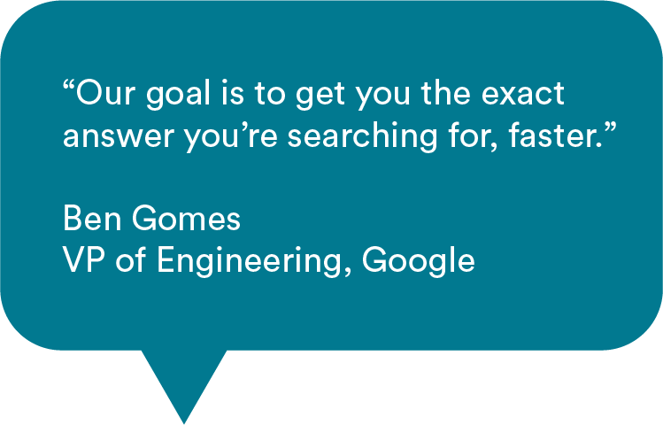
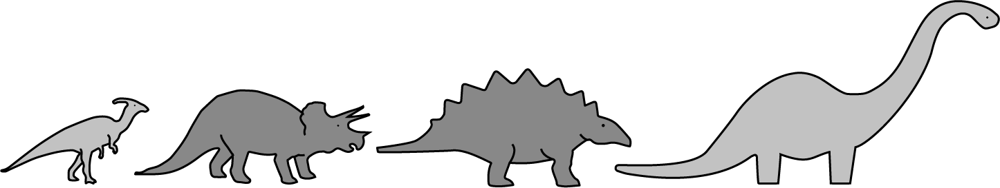
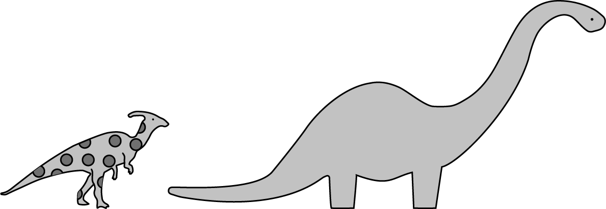

# 

The Facebook News Feed algorithm, the Google search algorithm, the Amazon recommendation algorithm: You might already be familiar with these “celebrity” algorithms. But complex algorithms like these start with the basics: sorting and searching. Algorithms are at the heart of computer programming, so let’s get to know them.

## What’s an Algorithm, Actually?

Simply put, an algorithm is a process. And like any process, an algorithm contains a set of steps you take in order to achieve a specific goal.

When you think of the word “algorithm,” you might associate it with math or computers. But did you know that humans use algorithms, too? Building IKEA furniture, solving a Rubik’s cube, and even making toast all involve algorithms that people (and not computers) follow.

Without an algorithm, a person may never solve that Rubik’s cube. But algorithms are even more important for computers, which need very literal, step-by-step instructions to complete any task.

Even a seemingly simple task, like searching for a value in a data set, has a lot of component parts:

- What exact steps should a computer program take to search a data set?
- Where does it look and what is it looking for?
- How does it know when it’s done?

There may be several different algorithms that can sort or find a value in a data set, and some of these may execute more quickly than others. Studying algorithms gives us the knowledge we need to find the best way to approach a problem.

## Do You Know the Most Famous Algorithm of All?

The most famous algorithm (well, in our opinion anyway) is Google’s search algorithm, which the tech titan uses to find, rank, and return the results of your search.

Google updates its algorithm 500–600 times per year. With more than 2 trillion searches occurring annually, even a small update can have a massive impact on what users see in their results.

For website owners, the Google search algorithm is like Moby Dick’s white whale: impossible to hunt down, capture, and understand. Instead, websites have to evolve alongside Google’s changes.

Case in point: **exact match domains** (EMDs).

## The Demise of Exact Match Domains: A Google Algorithm Story

_Transcript_

An exact match domain, or EMD, is a website name that precisely matches common search queries — for example, BuyCheapJeansOnline.com or WatchMoviesForFree.com.

“Watch movies for free” is a pretty common search phrase, and in the early 2010s, giving your website the same name could push you right to the top of Google’s search results. At that time, the algorithm gave greater weight to the words used in a domain name, rather than factors like user experience or quality of content on the site.

Sounds great, right? Unfortunately, no.

Back in the day, searching for “watch movies for free” didn’t always give you what you were looking for. Instead, that search would return a host of spammy, unsavory websites. Real streaming services like Hulu or Netflix weren’t anywhere near the top of search results.

Hulu and Netflix weren’t at the top of the “watch movies for free” search results because, like most legitimate companies, they use the name of their brand as the name of their website. By using “watch movies for free” language in their domain names, the spam sites were exploiting the Google search algorithm to beat out real companies.

By 2012, Google had caught onto this game. Google’s then head of web spam announced an algorithm change that would diminish the power of EMDs.

One small tweak to the algorithm, one giant leap to protect regular people on the internet.

_end of transcript_

## Another Familiar Algorithm: Making Toast

_Transcript_

Remember when we said that making toast is an example of an algorithm? It's such an easy task that you probably never thought about a step-by-step process for doing it. But what if you had to write an algorithm for making toast. We asked a few people to draw out how to make toast — an algorithm for toast-making, if you will.

As you can see, we got four totally different algorithms. Do any of these algorithms look like yours for making your morning toast?

When it comes to making toast, humans have a leg up on computers. Why? As humans, we are able to make a lot of assumptions based on past experiences and our own mental models for how to get things done.

But computers have none of that — no experience, no mental model. If we needed to program a robot chef to make our morning toast for us, how would we do that? Would any of these algorithms work? We’d have to get specific and super detailed, laying out each and every action that needs to be performed, where to get the inputs, and exactly what to do if something doesn’t go to plan.

With all of the steps you have to capture, you can begin to see how writing algorithms for computer programs is hard!

_end of transcript_

## Algorithms in Practice

Computer science algorithms can be as complex as Google’s search algorithm or as simple as a way to organize a list of numbers from smallest to largest. No matter its use, an algorithm is simply a set of instructions that tells a computer how to solve a problem.

Algorithms vary in complexity and purpose, but there are two major categories we’ll focus on in this unit:

- Sorting algorithms
- Searching algorithms

## Meet Sorting Algorithms

Want to put these dinosaurs in order from smallest to largest? Alphabetically by species? Most to least popular? There’s a sorting algorithm for that.

A sorting algorithm puts elements in a list in a certain order. This might sound simple, but when your data set has thousands, or even millions, of different items, it gets much more difficult.

Think about all of the things you interact with — on the web or in computer programs — that follow a certain order:

- Webpages
- Search results
- Task scheduling

Basically, anything that requires elements to be in an order has a sorting algorithm that lays the groundwork for preparing your data set for use. Sorting it as quickly and accurately as possible means you can get onto the more exciting stuff more quickly.

## Meet Search Algorithms

Remember those dinosaurs you sorted? You could also use an algorithm to find the dinosaur with the most spots or the one that’s the tallest.

A search algorithm retrieves information stored within a data structure.

Search might sound like a one-trick pony: It helps you find the needle in the haystack, end of story. But in reality, search algorithms do so much more! Have you ever used spell check? Logged into an account on a website? Or, you guessed it, used Google search? There are search algorithms behind all of those.

### Knowledge Check

A package delivery and logistics company uses an algorithm to determine the optimal route to deliver packages. This is an example of a...

1. Sorting Algorithm
2. Search Algorithm

 

Click for answer

 
Search Algorithm

The logistics company is finding one object (the best delivery route) from a certain set of objects (all of the potential ways the packages could be delivered), which uses a search algorithm.

 

### Knowledge Check

Describe one way in which you encountered a sorting algorithm today in real life.

 

Click for answer

 
Our Answer

Sorting algorithms are so ubiquitous that it’s hard to think of something that doesn’t have one!

Examples may be:

- The ranking of posts in your Instagram feed.
- Your contacts in your phone.
- The list of transactions in your bank account.
- The way you organize your T-shirts in your closet.

 

## Choosing the Algorithm That’s Right for You

Each algorithm classification — sorting and search — contains dozens of potential implementations. With so much variety, how do you know which algorithm to use in a given situation? You need to be able to weigh your options.

Algorithms are evaluated based on their computational complexity, or the amount of resources it takes to run them. Those resources include:

- **Time:** The maximum amount of time it would take the algorithm to solve a problem.
- **Space:** The maximum amount of computer memory, or RAM, the algorithm needs to run.

The data set you’re working with is another important factor in choosing an algorithm:

- Is it very large or very small?
- Very structured or very unstructured?
- What types of data does it contain?

By understanding algorithms at a high level, how they work, and the differences between them, you’ll become a more well-rounded engineer.

## Algorithm Preview

For the rest of these modules, we'll be learning about a variety of searching and sorting algorithms: how they work and how to implement them.

Here's a sneak preview!

| Sorting Algorithms | Search Algorithms  |
| ------------------ | ------------------ |
| Bubble sort        | Binary search      |
| Insertion sort     | Brute force search |
| Merge sort         |                    |
| Quick sort         |                    |
| Bucket sort        |                    |
| Radix sort         |                    |
